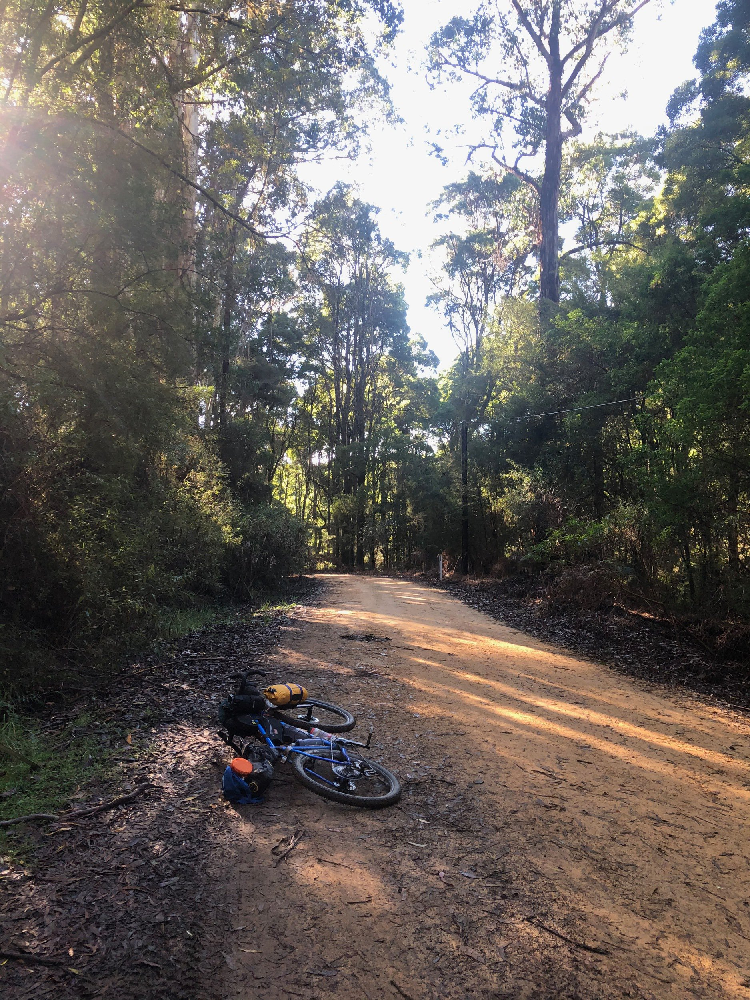
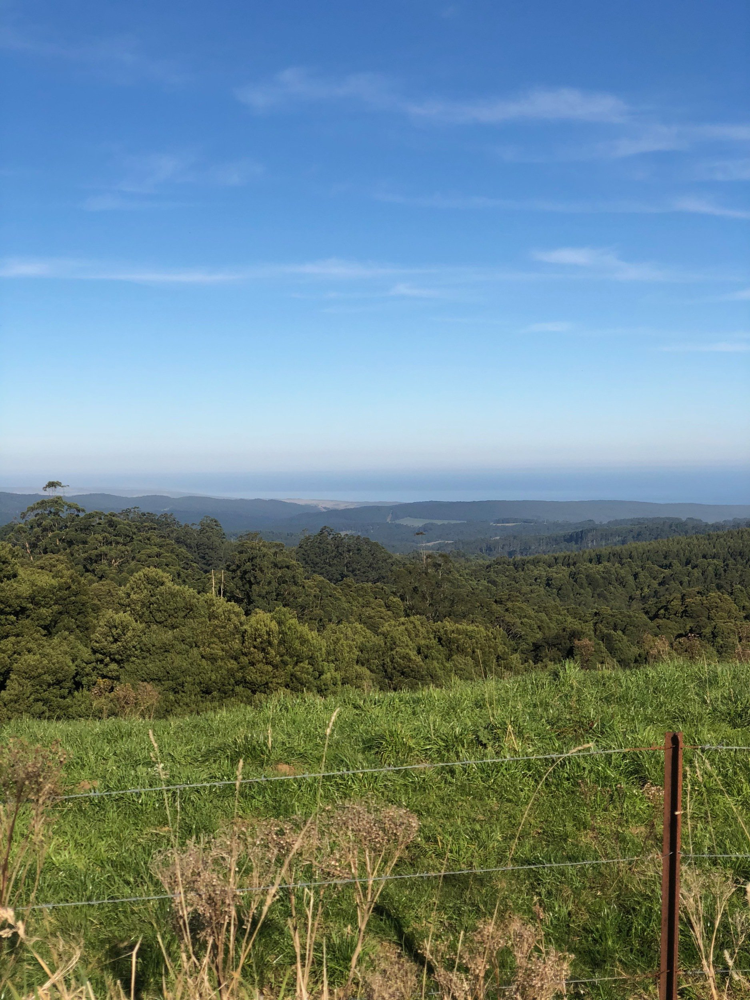
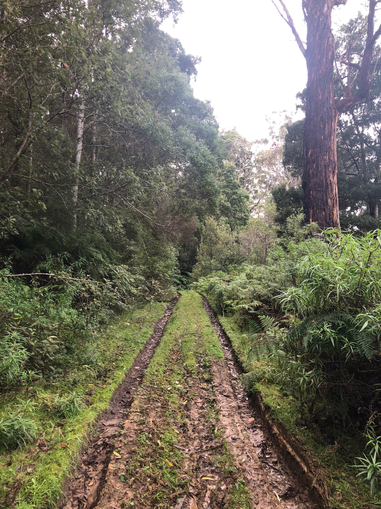

+++
title = "Otways West"
date = 2021-05-22
+++

# Overview

May 22 - 25 2021

<dl>
    <dt>Distance</dt>
    <dd>296.8km</dd>
    <dt>Elevation</dt>
    <dd>4678m</dd>
    <dt>Moving Time</dt>
    <dd>21h46m</dd>
</dl>

This route is an exploration of the western half of the Otways.

Starting at the Colac train station, then heading south-west to Princetown, skirting the edges between forest and pastoral land.  Then cutting across to the east up into the hills, with lush forest. Dropping back down to the coast and heading across Cape Otway, then through Apollo Bay before heading back north through the hills and back to Colac.

For 3 breakfasts and 3 dinners I cooked up a dehydrated meal, which consumed 70 grams of gas.

---

# Day 1 - Colac to Princetown

<iframe height='405' width='590' frameborder='0' allowtransparency='true' scrolling='no' src='https://www.strava.com/activities/5336977772/embed/3ac9152f1d851c48490de81277112328837bac31'></iframe>

I took the first VLine train to Colac, which departed Southern Cross at 6:55am. Once I arrived in Colac I picked up some supplies & a coffee from the bakery, had some brekky, and set off.

### 0 - 13km

The ride started with 13km on sealed, quiet, country roads. The speed limit was 80kmh but felt pretty safe with minimal traffic. around 10km in there were good views back over to the north and west from the top of the first climb.

### 13 - 17km

At this point I descended down a gravel road tracking through a gully only to find a sign at the bottom "Private Property no through access". Luckily, the farmer and his two kids on bicycles were about and they gave me directions through the property, over a fence, and on my way into the bush. If doing this route again I'd reroute around this.

### 17 - 30km

Continued mostly downhill on wide, well maintained fire roads through bushland, stopped for some lunch.

### 30km - 49km

This section started by wound its way through a pine plantation, then opened up along a ridge line, with bushland on the left and beautiful views out over plantations and farmland to the right

### 49km - 52km

Turned into the bushland and had a pretty quick descent down into a gully. Towards the bottom it got pretty muddy with thick, sticky, goopy mud. I didn't feel like stacking it so walked the bit at the bottom. A short climb up the other side popped me out in some pastoral land and at a sealed C road.

### 52 - 59km

A nice and fast descent down to Kennedy's Creek on the tarmac flinged all the mud off of my tyres. The road then turned to gravel and climbed back up at a reasonable grade.

### 59 - 70km

Turned left and followed along a ridge for a couple of k's, with great views off to the right, then had a fast and punchy gravel descent through bushland, the best of the ride so far. As the road started to mellow out I made a sharp right turn into the valley and started climbed out the other side.

Around this point the afternoon had turned to late afternoon, with it being rather dark under tree cover and stunning, warm light from the sun sitting low in the sky.

At the top of this climb the bushland turned to a ridge, the gravel to tarmac, with pastoral land on both sides, rolling downhill at a gentle gradient. A short-but-painful climb at the end put me near the top of Fords Rd.

### 70 - 76km

Descending down Fords Rd I had my first view of the ocean for the day. The road was undulating for the first km or two, and then had a short-but-sweet fast descent twisting down to a creek. for a few hundred metres the road was similarly steep climbing back out the other side, which then hit a T junction with the Great Ocean Rd.

### 76 - 80km

I sipped some water, set up my tail light, and prepared myself for the final TT stretch on the GOR to camp. It was mostly downhill with light traffic so wasn't quite as bad as I was fearing.

At this point the sun was very low in the sky, making for a beautiful coastal landscape. I cycled through the tiny township of Princetown (public toilets, a closed pub & a backpackers), and then over a boardwalk to the Princetown Recreation Reserve, where I set up camp for the night in a spot with a table on the edge of reserve.

---

# Day 2 - Princetown to Blanket Bay

<iframe height='405' width='590' frameborder='0' allowtransparency='true' scrolling='no' src='https://www.strava.com/activities/5342919054/embed/1d10d7c25455fbc0a016de79fe307cf810a26408'></iframe>

I got up around 7am feeling pretty fresh and took care of my morning camp chores, cooked some brekky, charge my devices, filled my bottles and packed up camp.

I rolled out of the rec reserve around 10am and went to the end of the road towards the beach for a quick look, but decided against venturing into the deep sandy 4WD tracks.

### 0 - 30km Old Ocean Road & Gellibrand River Road

I made my way back out of Princetown and then onto the first leg of the day, Old Ocean Road. When planning the route I thought this would just be a little back-road connector, but it turned out to be a real highlight of the trip. The road snaked its way up along the side of the Gellibrand river in a coastal valley with steep hills on both sides.

After 14km the road crossed over the Great Ocean Road and continued up the Gellibrand. This section was more of a roller coaster with much of the road a roller coaster of short climbs and descents. The scenery shifted from coastal plains to a mix of rainforest ferns and farmland.

### 30 - 47km Lavers Hill - Cobden Road

After two hours of tracking along the Gellibrand I turned right, and started the ascent to Lavers Hill. After a couple of flat k's the road wound its way up to Lavers Hill at a gentle 3.7% average gradient.

Initially the landscape was pastoral, but as the elevation increased it morphed into a lush rainforest with tall trees and large ferns. Creeks flowed under the road as it twisted through many gullies.

After climbing for a bit over an hour I popped out at Lavers Hill, a common cafe stop along the GOR. I fuelled up on a toastie, chips & a coke and filled up my bottles.

### 47 - 76km Colac - Lavers Hill Road, Wait-a-while Road, Aire Settlement Road & Old Ocean Road

From Lavers Hill I got rolling again along the mildly terrifying 100km/h limit Colac - Lavers Hill Road (which turned out to be fine). The road rolled its way up the ridge line, netting a further 120m of elevation.

Here I turned off to the right and descended down the twisting gravel Wait-a-while and Aire Settlement roads. Over 12km I dropped 500m through lush forest, averaging 28km/h. The descent was punctuated by a couple of short rises which served to stretch out the fun.

At the bottom of the descent there was a short and sharp climb back up to the GOR, which I travelled on for a few hundred metres before turning off again onto Old Ocean Road.

Old Ocean Road had a surface resembling yellow builders sand, which was rather slow-rolling which sapped a bit of the fun out of it. The landscape was nice with a mix of pastoral and rainforest. The road twisted down at a gentle gradient for 6km, again dropping me off at the GOR.

### 76 - 89km Sand Road & Horden Vale Road

The sun was starting to get low in the sky. I went along the GOR for a few hundred metres and turned off to the left down Sand Road. Sand Road was reminiscent of Old Ocean Road near Princetown at the start of the day, with a landscape mixing together coastal and pastoral elements, surrounded by steep hills. for the first couple of kilometres the road was very badly corrugated, with it being difficult to find a smooth line over the surface. 5km in I reached the Aire River Campground, crossed over the bridge, and had a quick stop to put on some additional layers for the imminent evening.

On the other side of the river there was a short and steep climb up out of the campgrounds to the ridge line, where I turned right and rolled down a few hundred metres towards Pigs Back Track. Upon arrival I was frustratingly met with a "Private Property No Access" sign and had to plan a reroute.

Scrolling around on the map on my phone I realised just how limited the options around Cape Otway were, and that the only way to get to my planned campsite was to trek back up to the Great Ocean Road and go around to Lighthouse Road.

With that, I climbed back up to where I turned off, and continued straight along the sealed Horden Vale Road all the way back up to the GOR. Initially there were a few very steep descents down to a bridge over a creek, then a steep climb out from the creek before plunging back down to the GOR. During this climbing I was starting to feel low on energy and smashed a Snickers bar, which helped.

### 89 - 107km Great Ocean Road, Lighthouse Road & Blanket Bay Road

Once I was at the base of the GOR the sun had well and truly set and I spent a few minutes getting my lights and reflective gear dialled in for the climb up the GOR. It was only 3km, but rose 190m at an average gradient of 6.8%. This was one of the more challenging sections of the ride, but I kept my head down and tapped out the climbing in 23 minutes. I was expecting this to be scary but after dark traffic was very light and I only saw a handful of cars. With my bright lights and reflective gear I felt safer and more visible than I would've been during the day.

I was very relieved to get to the Lighthouse Road turnoff at the top, and stopped and had a breather and some water. From here, I wound my way back down the 190m of elevation I'd just gained at a decent pace with my helmet and bar lights at max brightness. Descending in the dark with good, bright lights is a pretty cool experience, video-game-esque with the tunnel of vision that you have in front of you.

Towards the end of Lighthouse Road, I took a left turn to Blanket Bay Road for the final section of the day. Back on the gravel, the road descended and then had a couple of short climbs  hovering around the 5% mark, which, with the amount of fatigue in my legs, were pretty punishing.

The final section of the day descended down the rough and rutted Blanket Bay Road to the campgrounds, starting off at a gentle gradient, then steadily ramping up, with the final 100m at a sketchy -13%.

### Blanket Bay Campground

I got in to camp just before 7pm, a good two hours into the evening. I didn't have a nearby table at this site, but the toilets & water tank were closer. I set up camp and cooked my evening meal noticeably faster than the night before, even though being more fatigued. Practise paying off.

Looking back, I have mixed feelings about the last couple of sections, as Sand Road and the Aire River were real highlights of the day, but the trek from there back to the GOR was a real drag with a loaded bike.

---

# Day 3 - Blanket Bay to Dando's Campground

<iframe height='405' width='590' frameborder='0' allowtransparency='true' scrolling='no' src='https://www.strava.com/activities/5353553301/embed/9fcd6d51aeb2e661d49be09665323612fd8acf62'></iframe>

I got up a bit later on the second day, around 7:30am, and with the morning light could finally properly see the campgrounds. I moseyed over to the beach and got to see the sun low over the water, lighting up the bay. I completed my chores, filling my bottles from the rainwater tank, and again rolled out around 10am.

### 0 - 17km Parker Spur Road & Snowy Ridge Track

*10:01am*

To start the day I climbed back out of the campgrounds, with a painful 200m at 10+%. It was almost funny dealing with this kind of climbing first thing in the day. Once through the worst of it I continued back up Blanket Bay Road for a further kilometre, then rode past the gate of the MVO (management vehicle only) Parker Spur Road.

Parker Spur rolled its way uphill for a few kilometres, the track covered in fallen tree foliage but otherwise in good condition. There was one large tree that had fallen over the track that I had to get off and hike over.

After a couple of k's track conditions degraded and it became very soft and muddy. Initially I was dismounting to walk past the mud puddles, but after doing this a few times and felt I was burning too much time, I started riding through it instead. Sketchy at first, but I quickly got the hang of it, and was making quicker progress.

What I couldn't get a handle on were the muddy climbs, where my bike had absolutely no traction, the back wheel just spinning when I peddled. For these climbs I just had to hike it, and hope the surface was in good-enough condition on the other side to make up some time.

Through this section there were two intersections where the Great Ocean Walk joined and left the track, with a signpost and a couple of benches. I'm quite fond of intersections like this in the middle of the forest.

#### Snowy Ridge Track

After 1h45m riding and trekking along Parker Spur Road I reached the turn-off to Snowy Ridge Track. If not for my GPS I wouldn't have noticed it, it was just a narrow, overgrown trail to the right of the track, heading down the hill. I wondered for a minute or two if I should head down, double checked the heatmap online, and made the call to give it a shot.

The track had a definitive corridor that would've been cleared many years ago, but it was very, very overgrown. I doubt many had hiked (let alone cycled) down it recently. There was barely a "trail", it was a grassy strip surrounded by ferns.

I scooted my way down the slope, left foot on my pedal, right foot on the grass, and let gravity do its thing. I had a couple of low-speed stacks when unseen branches hooked their way around my pedals, and slid out on a slick log at a 45° angle to the trail. No harm done.

My rear brake was contaminated from the mud and loudly squealing   whenever used. I was grateful the front was still working well.

I found myself surrounded by massive, old trees. It was a surreal, intimate, experience seeing these trees up close on a track that has seen such little use. The distant rumble of GOR traffic the only thing reminding me I wasn't truly in the middle of nowhere.

Further down, the overgrowth got to its most extreme, with ferns _completely_ covering the track, and I regretted not packing a scythe. I battled my way through relatively unscathed, just having to untangle fern branches from my cassette and derailleur.

After this section it opened up slightly, with 4WD tyre tracks on the trail. I was actually able to descend some of this section at a decent clip, and popped out at Elliott Road, another connector to the Great Ocean Walk. From here I spun my way through a muddy, well trodden MVO track back up to the GOR.

### 17 - 25km Apollo Bay

*1:16pm*

Once back out on the GOR I tried my best to bomb it down the 145m of elevation to the coast, but a strong headwind made it hard to get past 40km/h. I briefly peaked at ~55km/h on the final ramp down to the coast line.

Once on the main strip of Apollo Bay I had a quick google and found a good burger joint for lunch, where I consumed a massive burger, chips and coke to replenish my energy levels. Similarly, my devices had a chance to recharge while I was gorging myself.

I popped into the supermarket for some more chocolate bars, the bakery for a coffee and some baked treats, filled my bottles and hit the road.

### 25 - 43km Barham River Road & Killala Road into Old Bay Road

*2:40pm*

The first couple of k's followed the Barham river, through the quaint farmland behind Apollo Bay. It then reached Killala Road, which branched off to the left, and ascended up into the mountain ridge.

Killala Road had properties on each side of the road at steady intervals, with driveways on the straighter and flatter sections.

The views back to the ocean over the hills were absolutely stunning, despite wanting to press on and crest the climb before sunset, I kept stopping for photos.

The road crossed over passes between hills a few times, with the  drop-off alternating from the right, to the left, and back to the right.

At the base of the road there's a sign "School Bus Route 3:30-4:30pm". Mid-way through Killala Road, I spotted a bus in the distance snaking its way up where I'd just climbed, 5 minutes later the bus passed me, and then another 10 minutes later, the bus passed me in the opposite direction.

Towards the top of Killala Road there were a few people out and about, a woman walking her dog, a father and son walking home from the bus stop.

Shortly after this point Killala Road became Old Bay Road, the surface became narrower, rougher and muddier, and the steep drop-off to the right was right up against the edge of the road. I felt comfortable negotiating this on my bicycle, but it would be terrifying being that close to the edge in a 4WD.

Old Bay Road twisted its way up at a gentle 3.5% gradient for 6km, going up the right-hand-side of the ridge.

While on the way up the climb the sun was dropping lower and lower in the sky, it became a bit of a race against time to get over the top of the climb and down the descent on the other side while I still had daylight.

after almost 2 hours of climbing I passed through an odd metal gate, and stopped for a photo with the "Road Closed" sign at the top.

### 43 - 53km Binns Road, Aire Valley Road

*4:48pm*

It was starting to get dark quickly, so I didn't linger for long and began the gravel descent down Binns Road, descending 3.6km at an average gradient of -6% in 5m30s, averaging 38km/h.

The descent was a mix of straighter sections with slight kinks, and a few sharper corners. Vision along the road was generally pretty good so I could ride the camber of the road and really rail the turns. Towards the bottom it got a bit rougher and vision was more restricted. I could still take inside turns (to the left) with speed but had to take outside turns slower.

Many of the corners were quite rutted and washed out, but as long as I took a consistent line through the corner the bike floated over it nicely.

At the bottom of the descent I reached a bridge over the beautiful Aire River and the redwood plantation.

On the other side of the bridge was Aire Valley Road. I was relieved to be climbing back out of the valley on tarmac.

Once out of the bottom of the valley I could see a the dazzling purple and red remnants of the sunset.

The wind also picked up dramatically once out of the valley, stopping me to put on knee warmers and full gloves. The cumulative effect of the 3000+m of climbing I'd done was starting to take its toll on my body. I had some panadol for pain flaring up in my right knee. I'm not sure if it worked, but within 30 minutes the pain had gone away.

Despite the wind, pain, and deepening darkness, my spirits remained pretty high, with another couple of hours on the bike ahead of me.

### 53 - 59km Beech Forest-Mount Sabine Road

*6:01pm*

At the top of Aire Valley Road I went a few minutes down the road to the town of Beech Forest, hoping to stop in at the pub for some dinner. Unfortunately the pub was closed (can't blame them, 6pm on a Monday night in the off-season), so I had some snacks and went on my way.

Beech Forest-Mount Sabine Road was another C-road thoroughfare that I was a bit concerned about riding on during planning, but at this time of the evening there's was almost no traffic, only seeing a single car.

This section was very exposed to the wind, coming in strongly from the north west.

I quickly descended the few kilometres to the Lardners Track turn-off.

### 59 - 72km Lardners Track, Sayers Track & Dando's Campground

*6:44pm*

I'd intended to camp at Stevensons Falls that evening, but made the call to switch to plan b, Dando's, as I'd be arriving after dark and it was a larger campground, less likely to disturb others, and I knew there was a _very_ steep -20% goat track down into Stevensons, which I wasn't keen on in the dark.

At the top of Lardners Track I spent a few minutes dialling in my lights, with a combined 2200 lumens between my bars and helmet. The battery for my helmet light was running low, so I was economical usage of the brighter modes. This is enough light to turn night to day, but descending down these forest roads was pushing them to their acceptable limits.

The first 2km went by in a couple of minutes, easily descending the -4% grade. From there the track forked, and I went right, onto Sayers Track (had I been better prepared I'd have gone left here, which looks like a better option to get through to Dando's).

After a short climb, the sketchy descending started, with a -12% ramp lasting a few hundred metres. This was followed by a flatter few k's, which gradually rolled downward, as the track conditions got worse and worse, with it looking like there was frequent logging truck activity tearing up the track and limited maintenance.

The track then twisted downward at around -10%, hitting 40km/h on the straights. Within my limits and under control, but having to pay total attention.

Coming out of the last left-hand bend there were mud puddles in the tyre tracks, so I aimed around them. What I didn't notice were the deep ruts from the tyre tracks, so as I turned to the right, my wheel caught on it, at first holding my in a straight line, then my front tyre snapped out of the rut and I was spearing at 45° towards the edge of the track. I managed to stop the bike before hitting anything, and the only harm done was to my confidence descending. Had I simply gone straight through the mud puddle I would've been completely fine. I inspected my tyre tracks in the mud to figure out what had happened, let my adrenaline levels relax, and continued on my way.

There was another flat kilometre, with the track conditions at their worst along this stretch.

I was then on to the last 2.5km of descending, which twisted its way down at an average of -10%, peaking at -14%. I was feeling very mentally fatigued at this point and just wanted to get to the end of it, so hit the straights fast and took the corners a bit easier. My brakes were struggling with the steepness of the track.

Once at the bottom of the descent I was relieved to have made it through Sayers Track unscathed. I climbed over the last, small, painful hill, and dropped in to Dando's.

### Dando's Campground

*7:39pm*

There were two caravans at the large, forested Dando's Campground when I arrived. I scouted the campground and picked a spot close to the toilets with a table.

I quickly set up camp and got dinner on the go, and was pleased with myself that despite fatigue I was able to have be eating dinner with my tent and sleep system set up within 40 minutes. Practise paying off.

---

# Day 4 - Dando's Campground to Colac

<iframe height='405' width='590' frameborder='0' allowtransparency='true' scrolling='no' src='https://www.strava.com/activities/5353553299/embed/fd92d883211c8437c7f6ed3835c20d44fbd555a1'></iframe>

I woke up around 6:30am and could really feel the accumulated fatigue. It was hard to get out of bed at first, but with the knowledge of a storm rolling in later in the day, I got up a bit after 7am and got to my morning chores.

I was expecting a rainwater tank at the campsite but the toilet block didn't have one, so I made my way over to the river running through the back of the campground, and found a path down to the water level to collect water for cooking.

From there the morning routine was pretty standard. Having a table really helped getting organised and repacking the bike. Having eaten most of my food the challenge of packing became quite a lot easier, freeing up space to juggle items between my bags.

### 0 - 4km Bridge Track

I set off and climbed over the hill out of the campgrounds. With fresher legs it was much easier than the night before.

Out of the campground, there was a bridge with further river access, which I used to fill up my bottles. It was difficult getting down the steep muddy embankment to the water level, with a couple of slips in the mud. Thankfully I didn't fall in.

Back on the bike, I crossed the bridge, and went up the most difficult climb of the trip. 2.3km at an average of 11.6% (238m gain), peaking at 16%.

This was another climb that had me also laughing amongst the pain at how ridiculous it was, particularly with the loaded bike and 3 days of fatigue in the legs.

I got in the zone of low cadence pedalling, and got to the top in 35 minutes at an average cadence of 41rpm.

### 4 - 16km Ridge Road, Kawarren East Road & Bull Hill Road

Once at the top, I turned left onto Ridge Road, a welcome downward roller coaster, with a steady rhythm of flowing 500m descents, followed by a few hundred metres of climbing.

After 10km the route took a couple of turns through the outskirts of small township, past a roadworks crew resurfacing Bull Hill Road, and into Kawareen, which had a school, community hall, and tennis courts.

### 16 - 24km Old Beechy Rail Trail

As I pulled into Kawareen it started raining, so I stopped undercover at the tennis courts and chucked on my full wet weather kit:

- jacket with hood under helmet
- rain pants with slap bands holding ankle cuffs in place
- waterproof socks
- waterproof gloves

The first section of the Old Beechy I rode was surprisingly technical, at least on a loaded bike. The rain soaked path followed along the side of the main road, then turning off to the right and over a hill. Once at the top there was a quick and twisty bomb down the other side through forest (with many signs reminding cyclists to take it slow 🙈).

From there it was on to the rail trail proper, which is much more what I was expecting: a constant slight 1% incline and very gentle curves. With the constant light rain and slight gradient, I found this one of the most mentally difficult sections of the ride, I just wanted to get to the end of it.

### 24 - 36km Return to Colac

Once in the outskirts of Colac the rail trail follows along a series of sandy gravel roads on the way in to the train station.

At this point, the ground was very wet from the last hour's rain, causing _a lot_ of wet sand to be flicked up and get into my chain and brakes while riding over it. 5 minutes of riding on the wet hard-packed sand left my chain crunching along painfully, and sandy brake rotors scraping against the pads.

I stopped twice to use a cloth to clean my chain, which temporarily solved the issue, only for it to return 5 minutes later. I took it easy for the rest of the gravel to reduce how much was being thrown into my drivetrain.

Back on sealed roads my bike crunched its way through the final few kilometres back to the train station, a wave of relief and satisfaction washing over me having made it to the end of the trip.

### Colac

Pulling into Colac I pulled up to a closed set of rail boom-gates on one of the major north-south streets. I was interested to see if it was for a train I'd just missed, and waited a few minutes, but nothing came past. I continued on to the station without crossing the tracks, and noticed a train stuck at the platform. I had a chat with the V/Line station attendant who explained the loco had broken down, with them having to send a replacement up from Melbourne to haul it away. Likely no further trains for the day.

I got changed into my casual clothes at the station, then decided to stay the night in Colac and catch the first train the next morning. I was too tired to deal with rail replacement coaches.

I had a beer at the pub, found a motel room for the night, went back to the pub for more beers, then slept.

The next morning I rode over to the station in the rain at 7:15am for the first train of the day, which took me back to Melbourne.